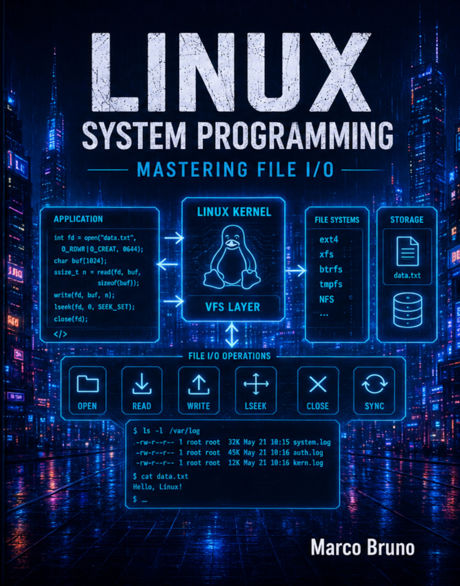

# Linux System Programming

# A Complete Linux Programming Reference.

# The best series to learn Linux programming. 

Together, these volumes provide one of the most comprehensive treatments of Linux system programming available, 
covering the complete lifecycle of Linux applications and the operating system interfaces they rely upon. From 
basic file operations to advanced concurrency, memory management, security, and communication mechanisms, the 
series serves as both a structured learning path and a long-term professional reference for modern Linux developers.

Volumes in the Series

# 1. Linux System Programming: Mastering File I/O
     Learn how Linux applications interact with files through system calls, standard I/O libraries, file descriptors, 
     asynchronous I/O, and advanced file operations.
     

# 2. Linux System Programming: Mastering the Filesystem
     Explore the Linux filesystem hierarchy, directories, device files, permissions, capabilities, quotas, mounts, 
     links, file monitoring, and filesystem-related system interfaces.

# 3. Linux System Programming: Mastering the Linux Runtime Environment
     Understand the runtime context in which Linux applications execute, including time management, locales, 
     environment variables, user and group databases, system identification, login records, networking databases, 
     and PAM authentication.

# 4. Linux System Programming: Mastering Memory
     Discover how Linux manages executable files, process startup and termination, memory allocation, memory mapping, 
     memory protection, dynamic loading, core dumps, and advanced memory-management interfaces.

# 5. Linux System Programming: Mastering Processes and Threads
     Master process creation, execution, scheduling, signals, timers, POSIX threads, synchronization primitives, 
     daemon development, logging, and secure process management.

# 6. Linux System Programming: Mastering IPC and Terminals
     Learn how Linux applications communicate through message queues, semaphores, shared memory, sockets, 
     UNIX domain sockets, terminals, and pseudo-terminals.

All the books are available on Amazona and Google Play:

Amazon:         https://a.co/d/01v9LXUb

Google Play:    https://play.google.com/store/books/details?id=bvzgEQAAQBAJ
