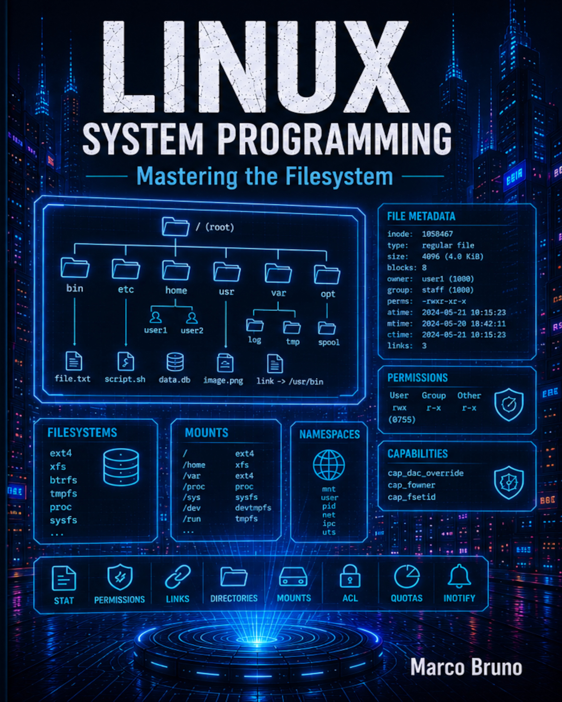

# Table of contents - MAstering the Filesystem

# 1. Files
	1.1 Stat of files: stat, fstat and lstat
	1.2 File permissions 
	1.3 Process credentials and privileges
	1.4 The file mode creation mask: umask
	1.5 Checking file accessibility: access and faccessat
	1.6 Changing file permissions: chmod and fchmod
	1.7 Changing file ownership: chown, fchown and lchown
	1.8 Creating and removing links: link, linkat and unlink
	1.9 Renaming files and directories: rename and renameat
	1.10 Symbolic links: symlink and readlink
	1.11 File time management: utimensat, futimens, utime, futimes
	1.12 I-node flags: ioctl
	1.13 Immutable files
	1.14 Extended attributes: setxattr, getxattr, removexattr, listxattr
# 2. Directories
	2.1 Creating and removing directories: mkdir, mkdirat and rmdir
	2.2 Opening and reading directories: opendir, fdopendir and readdir
	2.3 Closing directories: closedir
	2.4 Scanning a directory: scandir and scandirat
	2.5 Seeking a directory: telldir, seekdir and rewinddir
	2.6 Directory file descriptor: dirfd
	2.7 File tree walk: nftw
	2.8 Current working directory: getcwd, chdir and fchdir
	2.9 Process root directory: chroot	
# 3. Pathname and files configuration
	3.1 Resolving paths and links: realpath and canonicalize_file_name
	3.2 Working with pathnames: dirname and basename
	3.3 Pathnames and filenames configuration: fpathconf and pathconf
	3.4 Retrieving configuration at runtime with sysconf
	3.5 Retrieving configuration dependent string variables: confstr
	3.6 Retrieving configuration from the CLI with getconf
	3.7 Summary
# 4. Device files
	4.1 Major and minor numbers: makedev, major and minor
	4.2 Creating a device file: mknod and mknodat
	4.3 Creating FIFO: mkfifo and mkfifoat
	4.4 The random number generator: getrandom and getentropy
# 5. Access control list
# 6. Monitoring file events
	6.1 The inotify interface
	6.2 The fanotify interface
	6.3 Monitoring a directory with fanotify
# 7. Capabilitites
	7.1 File capabilities
	7.2 The Bounding Set
	7.3 The Securebits flags
	7.4 Listing the contents of the capabilities sets
	7.5 Capabilities data types
	7.6 Child capabilities
# 8. The Linux file system
	8.1 The ext4 layout
	8.2 Mounting a filesystem: mount and umount
	8.3 Remounting, binding and changing propagation type
	8.4 Moving a mount and creating a new mount
	8.5 Unmounting a filesystem
	8.6 Journaling and ext4 filesystem operations
	8.7 The swap area: swapon and swapoff
	8.8 The proc file system
	8.9 The tmpfs file system
	8.10 The sysfs file system
	8.11 Retrieving filesystem statistics : statfs and statvfs
	8.12 Mount namespaces
	8.13 Linux Namespaces: unshare 
	8.14 The setns function
# 9. Quotas and resource limits
	9.1 Managing quotas: quotactl
	9.2 Resource limits: getrlimit, setrlimit and prlimit
